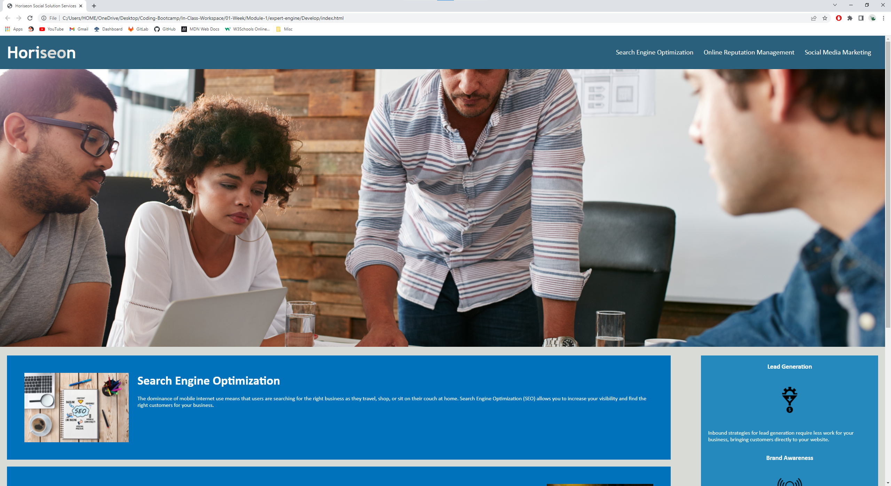
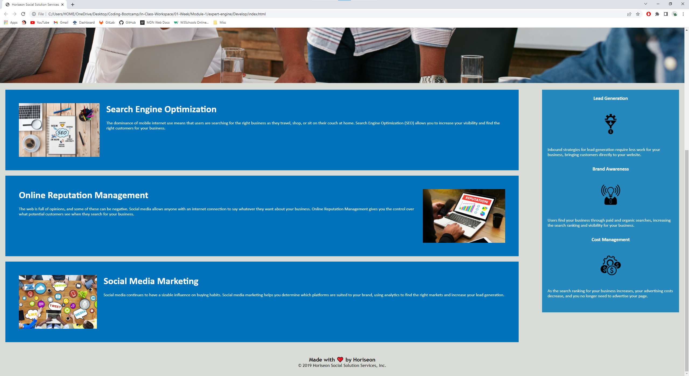

## Refactoring SEO

## Description

Refactoring the codebase for a marketing agency to follow accessibility standards so that the site is optimized for search engines. Added semantic HTML elements. Condensed CCS codebase. Added accessible alt attributes. Reordered codebase in sequential order.

## Installation

Create a folder and name it whatever you'd like. Open said folder with gitbash(Windows) or terminal(Mac). Simply type in: git clone https://github.com/WilliamL1998/expert-engine.git
This will clone the codebase from my remote repository to your local machine.
Open the expert-engine folder that has been cloned onto your machine in any IDE to see and edit the codebase.

Git clone https: https://github.com/WilliamL1998/expert-engine.git
URL of deployed application: https://williaml1998.github.io/expert-engine/

## Screenshots

## Credits

MDN Web Docs provided definition and syntax of aria-label:
https://developer.mozilla.org/en-US/docs/Web/Accessibility/ARIA/Attributes/aria-label